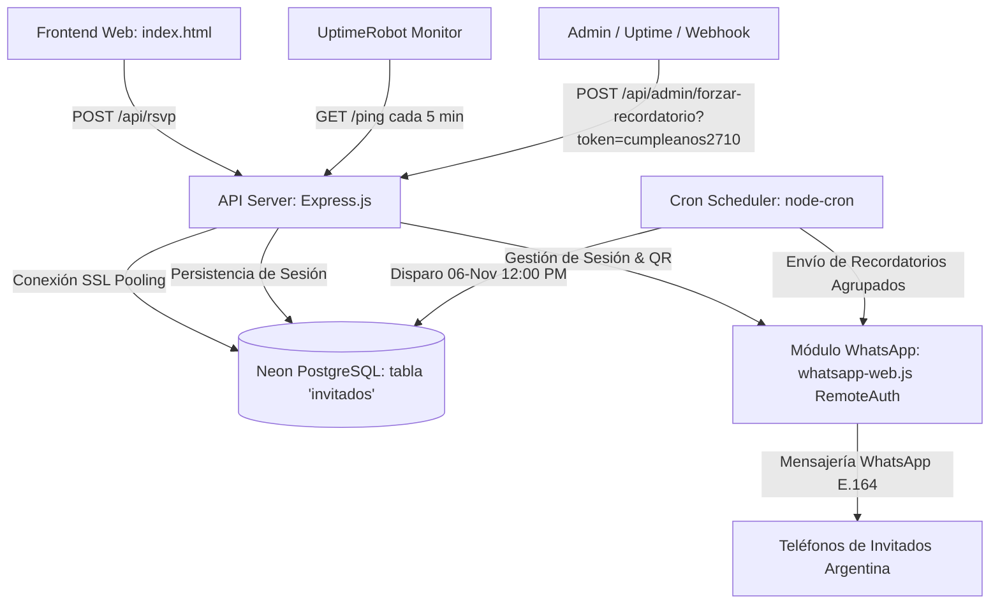

# Especificación Técnica Definitiva: Sistema de Invitación Digital y Automatización 15 Años (Keyberlis)

**Document ID:** SPEC-KEYBERLIS-15  
**Version:** 2.0.0  
**Stack:** Node.js (v20+ LTS), Express, Neon PostgreSQL, whatsapp-web.js (Puppeteer optimizado con RemoteAuth), node-cron, Render Free Tier, UptimeRobot  
**Status:** APPROVED & IMPLEMENTED  

---

## 1. Resumen Ejecutivo y Objetivos

El sistema centraliza la confirmación de asistencia (RSVP) para la fiesta de 15 años de **Keyberlis** (Sábado 07 de Noviembre de 2026), almacena los registros de forma idempotente y agrupable por familia en una base de datos PostgreSQL Serverless en **Neon**, mantiene el servicio activo 24/7 en el tier gratuito de **Render** mediante **UptimeRobot**, y provee un motor de **WhatsApp** para recordatorios programados el **6 de Noviembre a las 12:00 PM** con agrupación familiar, cola anti-ban (4 a 8 segundos de jitter) y alias de regalo oficial (`cumpleanos2710`).

---

## 2. Mapa de Capacidades y Dependencias (Capability Map)



| Módulo ID | Responsabilidad | Dependencias |
|---|---|---|
| `db-neon` | Esquema DDL, conexión SSL, soporte de múltiples invitados por teléfono `UNIQUE(nombre, telefono)` | Neon Postgres (`pg`) |
| `phone-normalizer` | Validación estricta E.164 Argentina (13 dígitos `54911xxxxxxxx`), rechazo 400 | — |
| `api-server` | Endpoints REST (`/api/rsvp`, `/ping`, `/api/admin/forzar-recordatorio`), CORS, Cache-Control | `db-neon`, `phone-normalizer` |
| `whatsapp-engine` | Autenticación multi-device QR, RemoteAuth persistido en Neon (`whatsapp_session`), flags de bajo consumo RAM (<512MB) | `db-neon`, Chrome Linux |
| `reminder-cron` | Temporizador 06-Nov 12:00 PM (`America/Buenos_Aires`), agrupación familiar, cola secuencial 4-8s jitter | `db-neon`, `whatsapp-engine` |

---

## 3. Decisiones de Arquitectura y Supuestos

### 3.1. Optimización para Render Free Tier (<512MB RAM)
- Chromium configurado con flags de mínima huella de memoria: `--no-sandbox`, `--disable-setuid-sandbox`, `--disable-dev-shm-usage`, `--disable-gpu`, `--disable-blink-features=AutomationControlled`.
- Sesión persistida remotamente en Neon Postgres a través de `lib/pgStore.js` (tabla `whatsapp_session`), evitando la pérdida de sesión ante reinicios del contenedor efímero.
- Manejadores globales `process.on('unhandledRejection')` y `process.on('uncaughtException')` para evitar reinicios por promesas no capturadas.

### 3.2. Zona Horaria y Precisión
- Zona horaria de referencia: `America/Buenos_Aires`.
- Disparo oficial del recordatorio: `2026-11-06 12:00:00 UTC-3`.
- Alias de regalo: `cumpleanos2710` (Mercado Pago).

---

## 4. Especificación de Base de Datos (Neon PostgreSQL)

### 4.1. Esquema DDL de la Tabla `invitados`
```sql
CREATE TABLE IF NOT EXISTS invitados (
    id SERIAL PRIMARY KEY,
    nombre VARCHAR(150) NOT NULL,
    telefono VARCHAR(20) NOT NULL,
    recordatorio_enviado BOOLEAN DEFAULT FALSE,
    fecha_registro TIMESTAMP DEFAULT CURRENT_TIMESTAMP
);

-- Migración: eliminar restricciones de teléfono único para permitir registro familiar
ALTER TABLE invitados DROP CONSTRAINT IF EXISTS invitados_telefono_key;
ALTER TABLE invitados DROP CONSTRAINT IF EXISTS uq_invitados_telefono;
ALTER TABLE invitados DROP CONSTRAINT IF EXISTS unique_nombre_telefono;
ALTER TABLE invitados ADD CONSTRAINT unique_nombre_telefono UNIQUE (nombre, telefono);

-- Índices de consulta rápida
CREATE INDEX IF NOT EXISTS idx_invitados_telefono ON invitados(telefono);
CREATE INDEX IF NOT EXISTS idx_invitados_recordatorio ON invitados(recordatorio_enviado);

-- Tabla para persistencia de sesión de WhatsApp (RemoteAuth en Neon)
CREATE TABLE IF NOT EXISTS whatsapp_session (
    id VARCHAR(100) PRIMARY KEY,
    data BYTEA NOT NULL,
    updated_at TIMESTAMP WITH TIME ZONE DEFAULT CURRENT_TIMESTAMP
);
```

### 4.2. Contrato de Datos (`Invitado`)
| Campo | Tipo | Nulo | Default | Descripción |
|---|---|---|---|---|
| `id` | `INTEGER` (Serial) | No | Auto | Clave primaria |
| `nombre` | `VARCHAR(150)` | No | - | Nombre y apellido del invitado |
| `telefono` | `VARCHAR(20)` | No | - | Número normalizado en formato E.164 (exactamente 13 dígitos: `54911xxxxxxxx`) |
| `recordatorio_enviado`| `BOOLEAN` | No | `false` | Indica si ya se le despachó el recordatorio |
| `fecha_registro` | `TIMESTAMP` | No | `CURRENT_TIMESTAMP` | Fecha de creación/actualización |

---

## 5. Especificación de Interfaz de API (REST API)

### 5.1. Endpoint: Registrar Asistencia
- **Ruta:** `POST /api/rsvp`
- **Headers:** `Content-Type: application/json`
- **Contrato de Solicitud:**
```json
{
  "nombre": "Juan Pérez",
  "telefono": "1161034151",
  "attending": true
}
```
- **Lógica de Validación:**
  - `attending === false`: Responde `200 OK` `{ success: true, saved: false, message: "..." }` sin guardar en DB.
  - `nombre`: Mínimo 2 caracteres, máximo 150 caracteres.
  - `telefono`: Limpieza de espacios, guiones y símbolos. Remoción de prefijos `0` y `15`. Validación de que el resultado sea de **13 dígitos exactos** comenzando con `549` (`54911xxxxxxxx`).
  - Si el teléfono es inválido o incompleto: Retorna **HTTP 400 Bad Request**:
    ```json
    {
      "success": false,
      "error": "El número de teléfono no es válido para Argentina. Debe contener código de área y celular (13 dígitos: 54911xxxxxxxx)."
    }
    ```
- **Respuestas Exitosas:**
  - `201 Created`:
  ```json
  {
    "success": true,
    "saved": true,
    "message": "Confirmación registrada exitosamente",
    "data": {
      "id": 1,
      "nombre": "Juan Pérez",
      "telefono": "5491161034151",
      "recordatorio_enviado": false,
      "fecha_registro": "2026-09-19T14:00:00.000Z"
    }
  }
  ```

### 5.2. Endpoint Administrativo de Forzado de Recordatorios
- **Ruta:** `POST /api/admin/forzar-recordatorio?token=cumpleanos2710`
- **Validación:**
  - Si `req.query.token !== 'cumpleanos2710'`: Retorna **HTTP 401 Unauthorized**:
    ```json
    { "success": false, "error": "Unauthorized: Token inválido" }
    ```
  - Si es correcto: Dispara asíncronamente el flujo de recordatorios y responde de inmediato con **HTTP 200 OK**:
    ```json
    { "success": true, "message": "Disparo de recordatorios iniciado asíncronamente." }
    ```

### 5.3. Endpoint Keep-Alive (UptimeRobot)
- **Ruta:** `GET /ping`
- **Propósito:** Responder HTTP 200 cada 5 minutos para mantener despierto el contenedor en Render.
- **Respuesta:**
```json
{
  "status": "healthy",
  "service": "cumpleanos-keyberlis",
  "whatsappReady": true,
  "uptime": 86400,
  "timestamp": "2026-09-19T14:00:00.000Z"
}
```

---

## 6. Lógica del Cron Job y Agrupación Familiar (`cron.js`)

### 6.1. Especificación del Trigger
- **Expresión Cron:** `0 12 6 11 *` (06 de Noviembre, 12:00 PM).
- **Timezone:** `America/Buenos_Aires`.

### 6.2. Agrupación Familiar y Formato de Mensaje
1. Consulta en Neon: `SELECT id, nombre, telefono FROM invitados WHERE recordatorio_enviado = false ORDER BY id ASC;`
2. Agrupación en memoria:
   - Se agrupan los IDs y nombres correspondientes a cada número de teléfono único.
   - Formateo de nombres:
     - 1 persona: `Juan`
     - 2 personas: `Juan y María`
     - 3+ personas: `Juan, María y Sofía`
3. Mensaje a despachar:
   ```text
   ¡Hola [NOMBRES]! Les recordamos que mañana es la gran fiesta de 15 años de Keyberlis. Por favor, confirmen su asistencia si aún no lo han hecho. Si desean realizar un presente, pueden hacerlo en efectivo a nuestro alias: cumpleanos2710
   ```
4. **Cola Secuencial Anti-Ban:** Pausa aleatoria (jitter) de 4 a 8 segundos (`4000 + Math.random() * 4000`) entre cada número telefónico procesado.
5. **Persistencia Inmediata:** Actualización atómica en Neon apenas concluye cada despacho con éxito:
   ```sql
   UPDATE invitados SET recordatorio_enviado = true WHERE id = ANY($1::int[]);
   ```

---

## 7. Criterios de Aceptación y Éxito

1. **Normalización:** Cualquier variación válida (`1161034151`, `011 15 6103 4151`, `+54 9 11 6103-4151`) produce `5491161034151`. Números incompletos o inválidos reciben HTTP 400.
2. **Múltiples Invitados por Teléfono:** Dos o más invitados pueden registrarse con el mismo teléfono sin colisión `UNIQUE (nombre, telefono)`.
3. **Agrupación en Recordatorio:** En el cron job, un teléfono con múltiples invitados recibe un solo mensaje WhatsApp con los nombres de todos los integrantes.
4. **Anti-Ban:** Existe una pausa aleatoria de 4 a 8 segundos entre cada despacho a WhatsApp.
5. **Seguridad Administrativa:** `/api/admin/forzar-recordatorio` exige `token=cumpleanos2710` y rechaza con 401 si no coincide.
